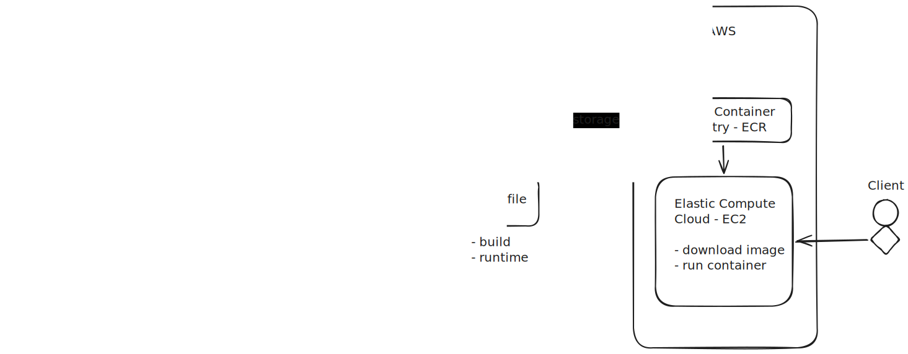

# 📦 User Management CLI

A simple Java-based CLI (Command Line Interface) application for managing users.  
This project was developed for the purpose of studies of basic Java structure, Maven build configuration, Docker and AWS cloud environment.

## 🚀 Technologies Used

- Java 17  
- Maven  
- Docker
- JUnit 5

## 📂 Project Structure

```
├── docs/ #Images
├── src/ #Source code
├── target/ #Compiled artifacts
├── pom.xml #Maven configuration
├── Dockerfile #Docker configuration
└── README.md
```

## 🐳 Running with Docker

### 1️⃣ Build the Docker image
```
docker build -t management .
```
### 2️⃣ Run the container (interactive mode)
```
docker run -it management
```

## ☁️ Application Lifecycle & Deployment Flow

The diagram below represents the complete lifecycle of the application, from local development to deployment on AWS.



### Flow Overview

1. Developer writes code locally
2. Maven builds the project and generates a JAR file
3. Docker builds a multi-stage image
4. The image is pushed to a container registry
5. The container runs in a cloud environment

This diagram illustrates how development, containerization, and cloud deployment are connected in a modern DevOps workflow.
